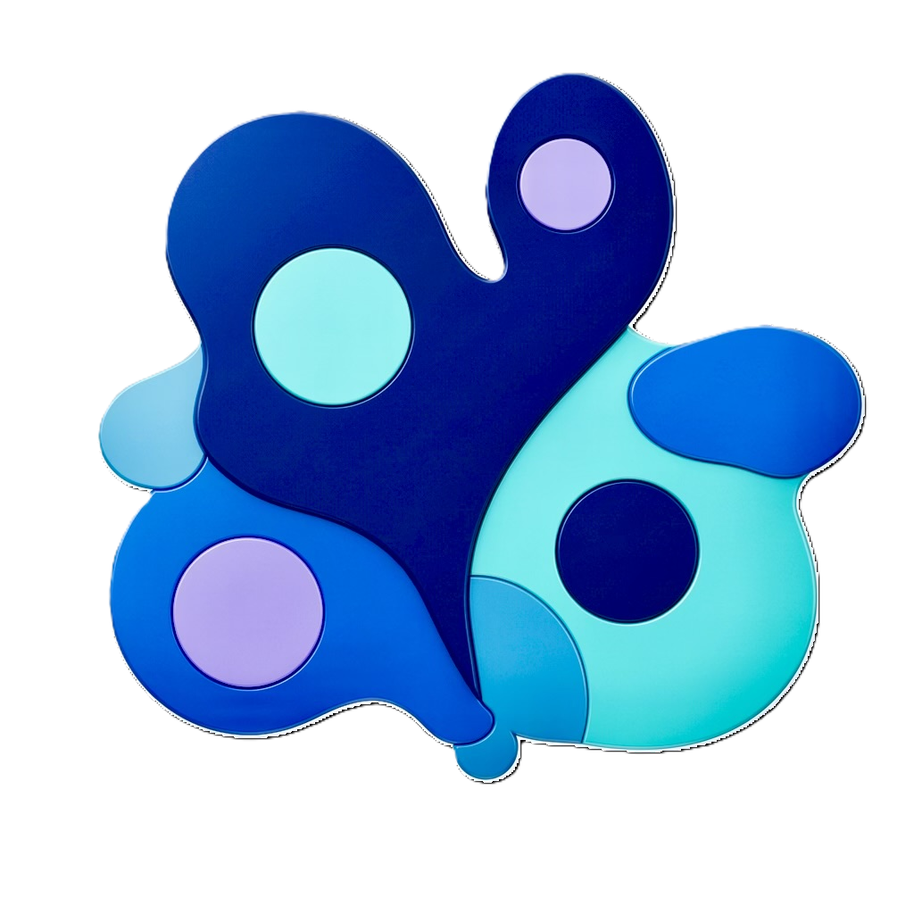
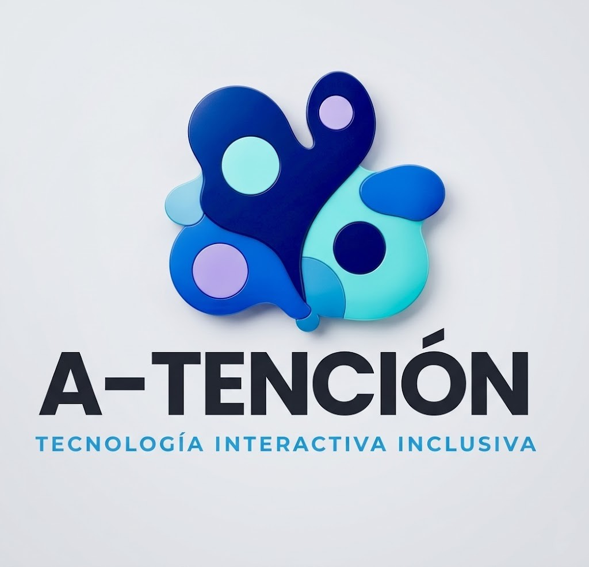
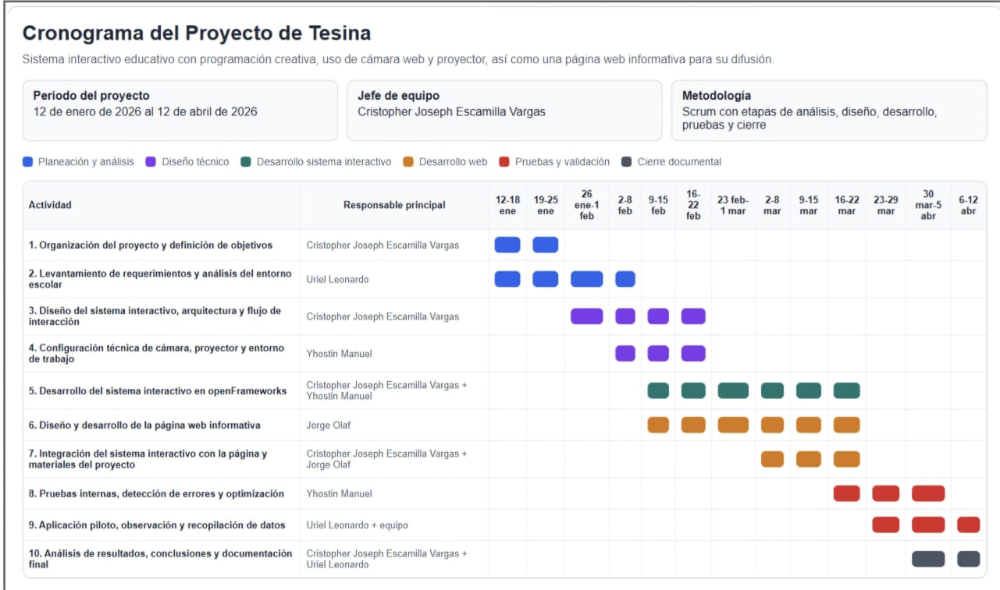
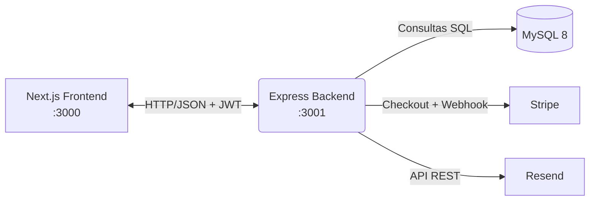

# Proyecto A-TENCIÓN

### A-TENCIÓN - IDENTIDAD GRÁFICA
<p align="justify">
La identidad gráfica de A-TENCIÓN busca transmitir valores de inclusión, empatía, profesionalismo y confianza. Cada elemento visual está diseñado para resonar con padres, tutores y terapeutas, destacando la importancia del desarrollo sensorial infantil y la accesibilidad tecnológica a servicios especializados para niños con necesidades especiales.
</p>

## LOGOTIPOS

<table>
   <td>Logo de la Aplicación</td>
   <td>Logo del Equipo</td>
  <tr>
    <td>    </td>
    <td>    </td>
  </tr>
</table>

### DESCRIPCIÓN
<p align="justify">
A-TENCIÓN es una plataforma web integral (Fullstack) diseñada para la gestión y comercialización de experiencias sensoriales infantiles. El sistema permite a los tutores explorar un catálogo de actividades terapéuticas y recreativas, realizar reservaciones en tiempo real y gestionar pagos de forma segura. Técnicamente, el proyecto emplea una arquitectura desacoplada con un Frontend en Next.js y un Backend robusto en Node.js/Express, utilizando MySQL para la persistencia de datos y servicios de terceros (Stripe y Resend) para funcionalidades críticas de pago y notificación.
</p>

---

### PLANTEAMIENTO DEL PROBLEMA

<p align="justify">En el contexto actual de la educación y el desarrollo infantil en la región, existe una carencia de plataformas digitales que faciliten el acceso a espacios sensoriales especializados. Los procesos de reserva de sesiones suelen realizarse por canales informales (WhatsApp o llamadas), lo que genera errores de agenda, sobreventa de cupos y falta de control administrativo. Adicionalmente, la inexistencia de pasarelas de pago digitales limita la formalidad del servicio y la comodidad del usuario, mientras que los administradores carecen de herramientas automatizadas para visualizar estadísticas de venta, asistencia o gestión de usuarios en tiempo real. Esta situación impacta negativamente en la eficiencia operativa del servicio y en la experiencia de los tutores que buscan apoyo cognitivo y sensorial para sus hijos.</p>

---

### PROPUESTA DE SOLUCIÓN
<p align="justify">En respuesta a los desafíos que enfrenta A-TENCIÓN en la gestión de reservas y la comercialización de sus servicios, se propone una aplicación web orientada a servicios que centralice la operación comercial y administrativa. La solución integra un motor de disponibilidad vinculado a la base de datos para evitar la sobreventa de cupos, un ecosistema de APIs externas con Stripe (procesamiento seguro de transacciones bancarias) y Resend (notificaciones transaccionales por correo electrónico), así como un panel administrativo basado en roles que permite la gestión de inventario, reservas y monitoreo de operaciones en tiempo real.</p>

---

### OBJETIVO GENERAL

<p align="justify">Desarrollar e implementar una plataforma web para la gestión de experiencias sensoriales, integrando servicios de terceros y una arquitectura cliente-servidor, que optimice el proceso de reserva y pago para los usuarios de A-TENCIÓN en el periodo enero-abril 2026.</p>

---

### OBJETIVOS ESPECÍFICOS

<p align="justify"><strong>Arquitectura Backend</strong>: Construir una API REST propia en Express que gestione la lógica de negocio, autenticación mediante JWT y la conexión al motor de base de datos MySQL.</p>

<p align="justify"><strong>Integración de Servicios</strong>: Implementar el consumo de APIs externas (Stripe y Resend) para garantizar la seguridad en los pagos y la comunicación automatizada con el cliente.</p>

<p align="justify"><strong>Experiencia de Usuario (UX/UI)</strong>: Crear una interfaz responsiva y moderna en Next.js que permita la navegación fluida desde cualquier dispositivo móvil o de escritorio.</p>

<p align="justify"><strong>Seguridad y Roles</strong>: Establecer un sistema de control de acceso basado en roles para diferenciar las funciones de los clientes (tutores) y los administradores (personal de la UTXJ).</p>

<p align="justify"><strong>Automatización de Reservas</strong>: Implementar un motor de disponibilidad en tiempo real que controle cupos, fechas y horarios para evitar conflictos de agenda y sobreventa.</p>

---

### DIAGRAMA DE GANTT



<p align="justify"><strong>Periodo del proyecto:</strong> 12 de enero de 2026 al 12 de abril de 2026. <strong>Jefe de equipo:</strong> Cristopher Joseph Escamilla Vargas. <strong>Metodología:</strong> Scrum con etapas de análisis, diseño, desarrollo, pruebas y cierre documental.</p>

---

### TABLA DE COLABORADORES

| Matrícula | Nombre | Usuario |
| :--- | :--- | :--- |
| M-240687 | Cristopher Joseph Escamilla Vargas | [CristopherEV](https://github.com/CJEscamilla) |
| M-240508 | Jorge Olaf García Quiroga | [JorgeOlaf](https://github.com/JorgeGQ) |
| M-240463 | Uriel Leonardo González Hernández | [UrielGH](https://github.com/LeoGonz18) |
| M-240071 | Yhostin Manuel Ramírez González | [YhostinRG](https://github.com/LaGuayaba01) |

---

### ORGANIGRAMA DEL EQUIPO


---

### LISTA DE TECNOLOGÍAS

<p align = "justify">

Cliente:


Servidor:


Servicios Externos:


Pruebas:


Documentación:


</p>

---

## Tabla de contenidos técnica

1. [Contexto General del Sistema](#contexto-general-del-sistema)
2. [Entregables de Definición](#1-entregables-de-definición)
3. [Stack Tecnológico](#2-stack-tecnológico)
4. [Arquitectura del Sistema](#3-arquitectura-del-sistema)
5. [Estructura del Proyecto](#4-estructura-del-proyecto)
6. [Guía de Instalación](#5-guía-de-instalación)
7. [Variables de Entorno](#6-variables-de-entorno)
8. [Esquema de Base de Datos](#7-esquema-de-base-de-datos)
9. [Ejecución en Desarrollo](#8-ejecución-en-desarrollo)
10. [Cuentas y Usuarios de Prueba](#9-cuentas-y-usuarios-de-prueba)
11. [Flujo de Pago con Stripe](#10-flujo-de-pago-con-stripe)
12. [Envío de Correos con Resend](#11-envío-de-correos-con-resend)
13. [Documentación de APIs](#12-documentación-de-apis)
14. [Troubleshooting](#13-troubleshooting)
15. [Equipo y Créditos](#14-equipo-y-créditos)

---

## Contexto General del Sistema
A-TENCIÓN es una plataforma web integral diseñada para la gestión de material educativo y experiencias sensoriales. El sistema actúa como un puente entre la plataforma y sus clientes principales (padres y terapeutas), permitiendo una administración eficiente de servicios de apoyo cognitivo y sensorial a través de un entorno digital intuitivo y seguro.

---


## Stack Tecnológico

| Capa | Tecnologías Clave |
|------|-------------------|
| **Frontend** | Next.js 14 (App Router) · React 18 · TypeScript · TailwindCSS · shadcn/ui · Framer Motion |
| **Backend** | Node.js 20+ · Express 4 · `mysql2/promise` · JWT · bcrypt · Zod |
| **Base de datos** | MySQL 8 |
| **Pagos** | Stripe Checkout (API REST) |
| **Emails** | Resend (API REST) |

> **API Propia** (`/api/own/*`): catálogo, autenticación, carrito, panel admin.<br>
> **APIs Externas** (`/api/integrations/*`): Stripe (pagos) y Resend (emails).

---

## Arquitectura del Sistema



<details>
<summary><b>Vista alternativa en ASCII</b></summary>

```
┌──────────────────────┐       HTTP/JSON + JWT        ┌──────────────────────┐
│   Next.js Frontend   │ ───────────────────────────▶ │   Express Backend    │
│   (localhost:3000)   │ ◀─────────────────────────── │   (localhost:3001)   │
└──────────────────────┘                              └──────────┬───────────┘
                                                                 │
                     ┌───────────────────────────────────────────┼───────────────────────────┐
                     ▼                                           ▼                           ▼
              ┌──────────────┐                           ┌──────────────┐            ┌──────────────┐
              │   MySQL 8    │                           │    Stripe    │            │    Resend    │
              │   proyecto   │                           │   Checkout   │            │ Transaccional│
              └──────────────┘                           └──────────────┘            └──────────────┘
```

</details>

---

## Estructura del Proyecto

```
Proyecto 5to/
├── backend/                      # API Express
│   ├── src/
│   │   ├── config/               # Pools/clientes: MySQL, Stripe, Resend
│   │   ├── middlewares/          # authMiddleware, adminMiddleware, validateBody
│   │   ├── routes/
│   │   │   ├── index.js          # Enrutador raíz (/api)
│   │   │   ├── own.js            # API propia (/api/own)
│   │   │   ├── integrations.js   # APIs externas (/api/integrations)
│   │   │   ├── auth.js           # Login + registro
│   │   │   ├── experiencias.js   # CRUD catálogo (público + admin)
│   │   │   ├── cart.js           # Carrito del usuario
│   │   │   ├── admin.js          # Panel administrador
│   │   │   ├── stripe.js         # Pagos + confirmación + webhook
│   │   │   └── resend.js         # Envío de correos
│   │   ├── utils/                # JWT, bcrypt helpers
│   │   ├── app.js                # Express + middlewares + rutas
│   │   └── server.js             # Bootstrap + listen
│   ├── .env                      # Variables de entorno (NO se commitea)
│   ├── .env.example              # Plantilla de variables
│   └── package.json
│
├── frontend/                     # App Next.js
│   ├── app/
│   │   ├── auth/                 # /login, /registro
│   │   ├── tienda/               # Catálogo y detalle
│   │   ├── carrito/              # Mis pendientes
│   │   ├── checkout/             # /checkout y /checkout/success
│   │   ├── admin/                # Panel admin (protegido)
│   │   ├── perfil/               # Perfil del tutor
│   │   ├── layout.tsx            # Layout raíz
│   │   └── page.tsx              # Home
│   ├── components/
│   │   ├── admin/                # Dashboard admin (5 tabs)
│   │   ├── layout/               # Header, Footer
│   │   ├── tienda/               # Cards y detalle
│   │   └── ui/                   # Componentes shadcn/ui
│   ├── lib/
│   │   ├── api.ts                # buildApiUrl, useAuth, adminFetch, etc.
│   │   ├── types.ts              # Tipos compartidos
│   │   └── utils.ts              # Helpers (formatDate, cn, etc.)
│   ├── hooks/                    # use-toast
│   ├── public/                   # Imágenes estáticas
│   ├── .env                      # NEXT_PUBLIC_API_URL
│   └── package.json
│
├── docs/
│   ├── API-Propia.md             # Endpoints internos
│   ├── API-Stripe.md             # Integración de pagos
│   └── API-Resend.md             # Integración de correos
│
├── .gitignore
└── README.md                     # Este archivo
```

---

## Guía de Instalación

### Requisitos previos

| Herramienta | Versión | Verificación |
|-------------|---------|--------------|
| Node.js | 20+ | `node -v` |
| npm | 10+ | `npm -v` |
| MySQL | 8 (puerto 3306) | `mysql --version` |
| Stripe | Cuenta gratuita | [dashboard.stripe.com/register](https://dashboard.stripe.com/register) |
| Resend | Cuenta gratuita | [resend.com/signup](https://resend.com/signup) |
| Git Bash | Recomendado en Windows | — |

### Instalación paso a paso

```bash
# 1) Clonar el repositorio
git clone <url-del-repo>
cd "Proyecto 5to"

# 2) Instalar dependencias del backend
cd backend
npm install

# 3) Instalar dependencias del frontend
cd ../frontend
npm install
```

---
## Ejecución en Desarrollo

Abre **dos terminales**:

```bash
# Terminal 1 · Backend (http://localhost:3001)
cd backend
npm run dev

# Terminal 2 · Frontend (http://localhost:3000)
cd frontend
npm run dev
```

Abre <http://localhost:3000> en el navegador.

---


## Equipo y Créditos

<p align="center">
  
  
  
</p>

- **Universidad:** Tecnológica de Xicotepec de Juárez
- **Programa:** T.S.U. en Desarrollo de Software Multiplataforma
- **Materia:** Aplicaciones Web Orientadas a Servicios (AWOS)
- **Docente:** M.T.I. Marco Antonio Ramírez Hernández
- **Cuatrimestre:** 5° · **Grupo:** B

### Integrantes

| Matrícula | Nombre |
|-----------|--------|
| **M-240687** | Cristopher Joseph Escamilla Vargas |
| **M-240508** | Jorge Olaf García Quiroga |
| **M-240463** | Uriel Leonardo González Hernández |
| **M-240071** | Yhostin Manuel Ramírez González |

---

<p align="center">
  <sub>Hecho por el equipo <b>Xicode</b> · Proyecto Integrador AWOS 2026</sub>
</p>
