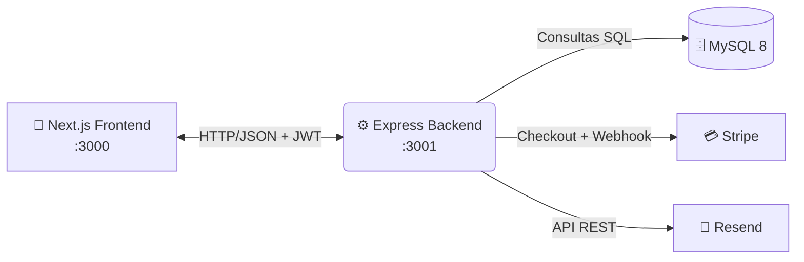
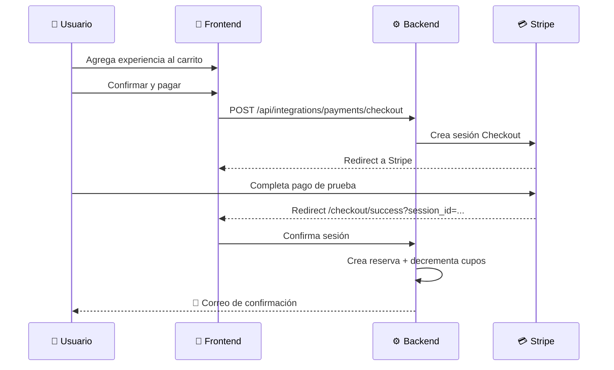
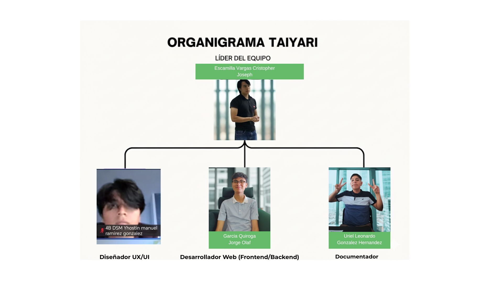

<!-- PORTADA -->
<p align="center">
  
</p>

<h1 align="center">✨ A-TENCIÓN · Sensory Platform</h1>

<p align="center">
  <em>Plataforma web integral para la reservación y gestión de experiencias sensoriales dirigidas a niños con necesidades especiales.</em>
</p>

<p align="center">
  
  
  
  
  
  
  
  
  
</p>

<p align="center">
  
</p>

---
# A-TENCION 

## 1. Contexto General del Sistema
**A-TENCION** es una plataforma web integral diseñada para la gestión de material educativo y experiencias sensoriales. El sistema actúa como un puente entre la plataforma y sus clientes principales (padres y terapeutas), permitiendo una administración eficiente de servicios de apoyo cognitivo y sensorial a través de un entorno digital intuitivo y seguro.

---

## 📑 Tabla de contenidos

1. [🎯 Entregables de Definición](#-1-entregables-de-definición)
2. [🧰 Stack Tecnológico](#-2-stack-tecnológico)
3. [🏗️ Arquitectura del Sistema](#️-3-arquitectura-del-sistema)
4. [📁 Estructura del Proyecto](#-4-estructura-del-proyecto)
5. [⚙️ Guía de Instalación](#️-5-guía-de-instalación)
6. [🔐 Variables de Entorno](#-6-variables-de-entorno)
7. [🗄️ Esquema de Base de Datos](#️-7-esquema-de-base-de-datos)
8. [🚀 Ejecución en Desarrollo](#-8-ejecución-en-desarrollo)
9. [👥 Cuentas y Usuarios de Prueba](#-9-cuentas-y-usuarios-de-prueba)
10. [💳 Flujo de Pago con Stripe](#-10-flujo-de-pago-con-stripe)
11. [📧 Envío de Correos con Resend](#-11-envío-de-correos-con-resend)
12. [📖 Documentación de APIs](#-12-documentación-de-apis)
13. [🐛 Troubleshooting](#-13-troubleshooting)
14. [📝 Equipo y Créditos](#-14-equipo-y-créditos)

---

## 🎯 1. Entregables de Definición

<details open>
<summary><b>🎯 Requerimientos Funcionales (FRs)</b></summary>

| ID | Requerimiento | Descripción |
|----|---------------|-------------|
| **FR01** | 🔑 Autenticación | Creación de cuentas y login seguro para padres y terapeutas. |
| **FR02** | 📚 Catálogo | Visualización detallada de material educativo y experiencias. |
| **FR03** | 📅 Reservas | Selección de fechas según disponibilidad en tiempo real. |
| **FR04** | 💳 Pagos | Procesamiento integrado de reservas a través de pasarela de pago. |
| **FR05** | ❌ Cancelaciones | Autogestión de citas desde el perfil del usuario. |

</details>

<details open>
<summary><b>🛡️ Requerimientos No Funcionales (NFRs)</b></summary>

| ID | Requerimiento | Descripción |
|----|---------------|-------------|
| **NFR01** | 🔒 Seguridad | Protección de transacciones y datos bajo protocolos SSL/HTTPS. |
| **NFR02** | 📱 Responsividad | Totalmente funcional en dispositivos móviles y de escritorio. |
| **NFR03** | ⚡ Rendimiento | Confirmaciones de pago procesadas en &lt; 5 segundos. |
| **NFR04** | 🌐 Disponibilidad | Operatividad del sistema garantizada al 99.9%. |

</details>

<details open>
<summary><b>📌 Reglas de Negocio (BRs)</b></summary>

| ID | Regla |
|----|-------|
| **BR01** | Una cita solo se considera agendada tras validarse exitosamente el pago. |
| **BR02** | Es obligatorio tener cuenta activa y sesión iniciada para reservar. |
| **BR03** | Cancelaciones aplicables solo con **24+ horas** de antelación. |

</details>

---

## 🧰 2. Stack Tecnológico

| Capa | Tecnologías Clave |
|------|-------------------|
| 🎨 **Frontend** | Next.js 14 (App Router) · React 18 · TypeScript · TailwindCSS · shadcn/ui · Framer Motion |
| ⚙️ **Backend** | Node.js 20+ · Express 4 · `mysql2/promise` · JWT · bcrypt · Zod |
| 🗄️ **Base de datos** | MySQL 8 |
| 💳 **Pagos** | Stripe Checkout (API REST) |
| 📧 **Emails** | Resend (API REST) |

> **API Propia** (`/api/own/*`): catálogo, autenticación, carrito, panel admin.<br>
> **APIs Externas** (`/api/integrations/*`): Stripe (pagos) y Resend (emails).

---

## 🏗️ 3. Arquitectura del Sistema



<details>
<summary><b>📐 Vista alternativa en ASCII</b></summary>

```
┌──────────────────────┐       HTTP/JSON + JWT        ┌──────────────────────┐
│   Next.js Frontend   │ ───────────────────────────▶ │   Express Backend    │
│   (localhost:3000)   │ ◀─────────────────────────── │   (localhost:3001)   │
└──────────────────────┘                              └──────────┬───────────┘
                                                                 │
                     ┌───────────────────────────────────────────┼───────────────────────────┐
                     ▼                                           ▼                           ▼
              ┌──────────────┐                           ┌──────────────┐            ┌──────────────┐
              │   MySQL 8    │                           │    Stripe    │            │    Resend    │
              │   proyecto   │                           │   Checkout   │            │ Transaccional│
              └──────────────┘                           └──────────────┘            └──────────────┘
```

</details>

---

## 📁 4. Estructura del Proyecto

```
Proyecto 5to/
├── backend/                      # API Express
│   ├── src/
│   │   ├── config/               # Pools/clientes: MySQL, Stripe, Resend
│   │   ├── middlewares/          # authMiddleware, adminMiddleware, validateBody
│   │   ├── routes/
│   │   │   ├── index.js          # Enrutador raíz (/api)
│   │   │   ├── own.js            # API propia (/api/own)
│   │   │   ├── integrations.js   # APIs externas (/api/integrations)
│   │   │   ├── auth.js           # Login + registro
│   │   │   ├── experiencias.js   # CRUD catálogo (público + admin)
│   │   │   ├── cart.js           # Carrito del usuario
│   │   │   ├── admin.js          # Panel administrador
│   │   │   ├── stripe.js         # Pagos + confirmación + webhook
│   │   │   └── resend.js         # Envío de correos
│   │   ├── utils/                # JWT, bcrypt helpers
│   │   ├── app.js                # Express + middlewares + rutas
│   │   └── server.js             # Bootstrap + listen
│   ├── .env                      # Variables de entorno (NO se commitea)
│   ├── .env.example              # Plantilla de variables
│   └── package.json
│
├── frontend/                     # App Next.js
│   ├── app/
│   │   ├── auth/                 # /login, /registro
│   │   ├── tienda/               # Catálogo y detalle
│   │   ├── carrito/              # Mis pendientes
│   │   ├── checkout/             # /checkout y /checkout/success
│   │   ├── admin/                # Panel admin (protegido)
│   │   ├── perfil/               # Perfil del tutor
│   │   ├── layout.tsx            # Layout raíz
│   │   └── page.tsx              # Home
│   ├── components/
│   │   ├── admin/                # Dashboard admin (5 tabs)
│   │   ├── layout/               # Header, Footer
│   │   ├── tienda/               # Cards y detalle
│   │   └── ui/                   # Componentes shadcn/ui
│   ├── lib/
│   │   ├── api.ts                # buildApiUrl, useAuth, adminFetch, etc.
│   │   ├── types.ts              # Tipos compartidos
│   │   └── utils.ts              # Helpers (formatDate, cn, etc.)
│   ├── hooks/                    # use-toast
│   ├── public/                   # Imágenes estáticas
│   ├── .env                      # NEXT_PUBLIC_API_URL
│   └── package.json
│
├── docs/
│   ├── API-Propia.md             # Endpoints internos
│   ├── API-Stripe.md             # Integración de pagos
│   └── API-Resend.md             # Integración de correos
│
├── .gitignore
└── README.md                     # Este archivo
```

---

## ⚙️ 5. Guía de Instalación

### ✅ Requisitos previos

| Herramienta | Versión | Verificación |
|-------------|---------|--------------|
| Node.js | 20+ | `node -v` |
| npm | 10+ | `npm -v` |
| MySQL | 8 (puerto 3306) | `mysql --version` |
| Stripe | Cuenta gratuita | [dashboard.stripe.com/register](https://dashboard.stripe.com/register) |
| Resend | Cuenta gratuita | [resend.com/signup](https://resend.com/signup) |
| Git Bash | Recomendado en Windows | — |

### 📦 Instalación paso a paso

```bash
# 1) Clonar el repositorio
git clone <url-del-repo>
cd "Proyecto 5to"

# 2) Instalar dependencias del backend
cd backend
npm install

# 3) Instalar dependencias del frontend
cd ../frontend
npm install
```

---

## 🔐 6. Variables de Entorno

### 📄 `backend/.env`

Copia `.env.example` a `.env` y rellena los valores:

```bash
# ---- Base de datos ----
DB_HOST=localhost
DB_PORT=3306
DB_USER=root
DB_PASSWORD=tu_password
DB_NAME=proyecto

# ---- JWT ----
JWT_SECRET=una_clave_larga_y_aleatoria_min_32_caracteres
JWT_EXPIRES_IN=7d

# ---- Servidor ----
PORT=3001
FRONTEND_URL=http://localhost:3000

# ---- Stripe (modo test) ----
STRIPE_SECRET_KEY=sk_test_51xxxxxxxxxxxxxxxxxxxxxxxxx
STRIPE_WEBHOOK_SECRET=whsec_xxxxxxxxxxxxxxxxxxxxxxxxx

# ---- Resend ----
RESEND_API_KEY=re_xxxxxxxxxxxxxxxxxxxxxxxxx
RESEND_FROM_EMAIL=onboarding@resend.dev
RESEND_FROM_NAME=A-TENCIÓN
# (OPCIONAL) En plan free Resend solo envía al email registrado.
# Sobreescribe el destinatario para pruebas:
RESEND_OVERRIDE_TO=tu-email-registrado-en-resend@gmail.com
```

### 📄 `frontend/.env`

```bash
NEXT_PUBLIC_API_URL=http://localhost:3001
```

---

## 🗄️ 7. Esquema de Base de Datos

Crea la base de datos y las **6 tablas** que usa la aplicación:

```sql
CREATE DATABASE IF NOT EXISTS proyecto
  DEFAULT CHARACTER SET utf8mb4
  DEFAULT COLLATE utf8mb4_unicode_ci;
USE proyecto;

CREATE TABLE user (
  id          VARCHAR(191) NOT NULL PRIMARY KEY,
  nombre      VARCHAR(191) NOT NULL,
  email       VARCHAR(191) NOT NULL UNIQUE,
  password    VARCHAR(191) NOT NULL,
  telefono    VARCHAR(191) NULL,
  role        VARCHAR(50)  NOT NULL DEFAULT 'tutor',
  createdAt   DATETIME(3)  NOT NULL DEFAULT CURRENT_TIMESTAMP(3),
  updatedAt   DATETIME(3)  NOT NULL DEFAULT CURRENT_TIMESTAMP(3)
);

CREATE TABLE nino (
  id                VARCHAR(191) NOT NULL PRIMARY KEY,
  nombre            VARCHAR(191) NOT NULL,
  edad              INT          NOT NULL,
  notasSensoriales  TEXT         NULL,
  tutorId           VARCHAR(191) NOT NULL,
  createdAt         DATETIME(3)  NOT NULL DEFAULT CURRENT_TIMESTAMP(3),
  updatedAt         DATETIME(3)  NOT NULL,
  INDEX nino_tutorId_idx (tutorId),
  FOREIGN KEY (tutorId) REFERENCES user(id) ON DELETE CASCADE
);

CREATE TABLE experiencia (
  id                VARCHAR(191) NOT NULL PRIMARY KEY,
  nombre            VARCHAR(191) NOT NULL,
  categoria         VARCHAR(191) NOT NULL,
  descripcion       TEXT         NOT NULL,
  descripcionLarga  TEXT         NULL,
  precio            DOUBLE       NOT NULL,
  duracionMinutos   INT          NOT NULL,
  rangoEdad         VARCHAR(191) NULL,
  tamanoGrupo       VARCHAR(191) NULL,
  beneficios        TEXT         NULL,
  incluye           TEXT         NULL,
  color             VARCHAR(191) NULL,
  imagenUrl         VARCHAR(191) NULL,
  rating            DOUBLE       NOT NULL DEFAULT 0,
  reviews           INT          NOT NULL DEFAULT 0,
  createdAt         DATETIME(3)  NOT NULL DEFAULT CURRENT_TIMESTAMP(3),
  updatedAt         DATETIME(3)  NOT NULL
);

CREATE TABLE fechadisponible (
  id                VARCHAR(191) NOT NULL PRIMARY KEY,
  experienciaId     VARCHAR(191) NOT NULL,
  fecha             DATETIME(3)  NOT NULL,
  horaInicio        VARCHAR(191) NOT NULL,
  horaFin           VARCHAR(191) NOT NULL,
  cuposTotales      INT          NOT NULL,
  cuposDisponibles  INT          NOT NULL,
  createdAt         DATETIME(3)  NOT NULL DEFAULT CURRENT_TIMESTAMP(3),
  INDEX fechadisponible_experienciaId_idx (experienciaId),
  FOREIGN KEY (experienciaId) REFERENCES experiencia(id) ON DELETE CASCADE
);

CREATE TABLE reserva (
  id         VARCHAR(191) NOT NULL PRIMARY KEY,
  tutorId    VARCHAR(191) NOT NULL,
  total      DOUBLE       NOT NULL,
  estado     ENUM('Pendiente','Confirmada','Cancelada') NOT NULL DEFAULT 'Pendiente',
  createdAt  DATETIME(3)  NOT NULL DEFAULT CURRENT_TIMESTAMP(3),
  INDEX reserva_tutorId_idx (tutorId),
  FOREIGN KEY (tutorId) REFERENCES user(id) ON DELETE CASCADE
);

CREATE TABLE detallereserva (
  id                  VARCHAR(191) NOT NULL PRIMARY KEY,
  reservaId           VARCHAR(191) NOT NULL,
  experienciaId       VARCHAR(191) NOT NULL,
  fechaDisponibleId   VARCHAR(191) NOT NULL,
  ninoId              VARCHAR(191) NULL,
  cantidad            INT          NOT NULL DEFAULT 1,
  precioUnitario      DOUBLE       NOT NULL,
  INDEX detallereserva_reservaId_idx (reservaId),
  INDEX detallereserva_experienciaId_idx (experienciaId),
  INDEX detallereserva_fechaDisponibleId_idx (fechaDisponibleId),
  INDEX detallereserva_ninoId_idx (ninoId),
  FOREIGN KEY (reservaId)         REFERENCES reserva(id)         ON DELETE CASCADE,
  FOREIGN KEY (experienciaId)     REFERENCES experiencia(id)     ON DELETE RESTRICT,
  FOREIGN KEY (fechaDisponibleId) REFERENCES fechadisponible(id) ON DELETE RESTRICT,
  FOREIGN KEY (ninoId)            REFERENCES nino(id)            ON DELETE SET NULL
);
```

> 💡 **Tip:** Si prefieres un cliente con UI, copia el bloque anterior en MySQL Workbench → `Query → Execute`.

---

## 🚀 8. Ejecución en Desarrollo

Abre **dos terminales**:

```bash
# Terminal 1 · Backend (http://localhost:3001)
cd backend
npm run dev

# Terminal 2 · Frontend (http://localhost:3000)
cd frontend
npm run dev
```

Abre <http://localhost:3000> en el navegador. 🎉

---

## 👥 9. Cuentas y Usuarios de Prueba

### 🛡️ Emails hardcoded con rol `admin`

Los siguientes correos, al registrarse o iniciar sesión, reciben automáticamente rol de administrador (definido en `backend/src/utils/jwt.js`):

```
240508@utxjicotepec.edu.mx
240687@utxjicotepec.edu.mx
240463@utxjicotepec.edu.mx
240071@utxjicotepec.edu.mx
```

Cualquier otro email se registra como `tutor`.

### ✍️ Registro manual

1. Abre <http://localhost:3000/auth/registro>
2. Completa el formulario (contraseña ≥ 6 caracteres)
3. Serás redirigido al catálogo; si tu email está en la lista admin, al panel `/admin/reservas`

---

## 💳 10. Flujo de Pago con Stripe

> 🧪 **Modo test** — nunca se procesan cargos reales.

### 💳 Tarjetas de prueba útiles

| Escenario | Número | Expiración | CVC |
|-----------|--------|------------|-----|
| ✅ Pago exitoso | `4242 4242 4242 4242` | Cualquiera futura | `123` |
| 🔐 Requiere autenticación 3DS | `4000 0025 0000 3155` | Cualquiera futura | `123` |
| ❌ Tarjeta declinada | `4000 0000 0000 9995` | Cualquiera futura | `123` |

### 🔁 Flujo completo



### 🔔 Webhook (opcional en dev)

Para probar el webhook localmente:

```bash
# Instalar Stripe CLI → https://stripe.com/docs/stripe-cli
stripe listen --forward-to localhost:3001/api/integrations/payments/webhook
```

Copia el `whsec_...` que imprime la CLI en `STRIPE_WEBHOOK_SECRET` del `.env`.

---

## 📧 11. Envío de Correos con Resend

- ⚠️ El plan **free** de Resend con `onboarding@resend.dev` **solo permite enviar al email con el que te registraste**.
- 🧪 Para pruebas usa `RESEND_OVERRIDE_TO=...` en el `.env` → todos los correos se redirigen ahí.
- 🌐 En producción, verifica un **dominio propio** en el dashboard de Resend.

📬 Puedes ver el historial de correos enviados en <https://resend.com/emails>.

---

## 📖 12. Documentación de APIs

Tres documentos detallados con endpoints, parámetros, respuestas y ejemplos `curl`:

| Documento | Descripción |
|-----------|-------------|
| [`docs/API-Propia.md`](./docs/API-Propia.md) | Backend Express (`/api/own/*`) |
| [`docs/API-Stripe.md`](./docs/API-Stripe.md) | Integración de pagos |
| [`docs/API-Resend.md`](./docs/API-Resend.md) | Integración de correos |

---

## 🐛 13. Troubleshooting

| Problema | Causa | Solución |
|----------|-------|----------|
| `ECONNREFUSED 127.0.0.1:3306` | MySQL apagado | Inicia el servicio MySQL |
| `Error: STRIPE_SECRET_KEY no está configurada` | `.env` falta o sin `sk_test_...` | Copia la key desde Stripe dashboard |
| `Invalid API Key provided` (Stripe 401) | Key truncada o mal copiada | Regenerar y pegar completa (empieza con `sk_test_51...`) |
| `Datos inválidos` al pagar | Zod rechazó el body | Revisa que el carrito tenga items con IDs válidos |
| No llega correo de confirmación | Email distinto al registrado en Resend | Agregar `RESEND_OVERRIDE_TO` al `.env` |
| Puerto 3001 ocupado | Otro proceso usa el puerto | `lsof -i :3001` + `kill <PID>` o cambia `PORT` en `.env` |
| `CORS blocked` | Backend sin `cors()` | Verifica que `app.js` use `app.use(cors())` |
| `ERESOLVE` al `npm install` frontend | `eslint-config-next` incompatible | Ya bajado a `^14.2.35`; si persiste: `npm install --legacy-peer-deps` |
| Admin panel muestra reservas vacías aunque existan | Token expirado | Logout + login para renovar JWT |

---

## 📝 14. Equipo y Créditos

<p align="center">
  
  
  
</p>

- 🏛️ **Universidad:** Tecnológica de Xicotepec de Juárez
- 🎓 **Programa:** T.S.U. en Desarrollo de Software Multiplataforma
- 📘 **Materia:** Aplicaciones Web Orientadas a Servicios (AWOS)
- 👨‍🏫 **Docente:** M.T.I. Marco Antonio Ramírez Hernández
- 📅 **Cuatrimestre:** 5° · **Grupo:** B

### 👨‍💻 Integrantes

| Matrícula | Nombre |
|-----------|--------|
| **M-240687** | Cristopher Joseph Escamilla Vargas |
| **M-240508** | Jorge Olaf García Quiroga |
| **M-240463** | Uriel Leonardo González Hernández |
| **M-240071** | Yhostin Manuel Ramírez González |

---
<p align="center">
  
</p>
<p align="center">
  <sub>Hecho con 💜 por el equipo <b>Xicode</b> · Proyecto Integrador AWOS 2026</sub>
</p>
